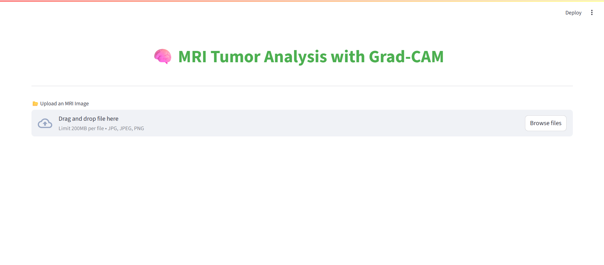
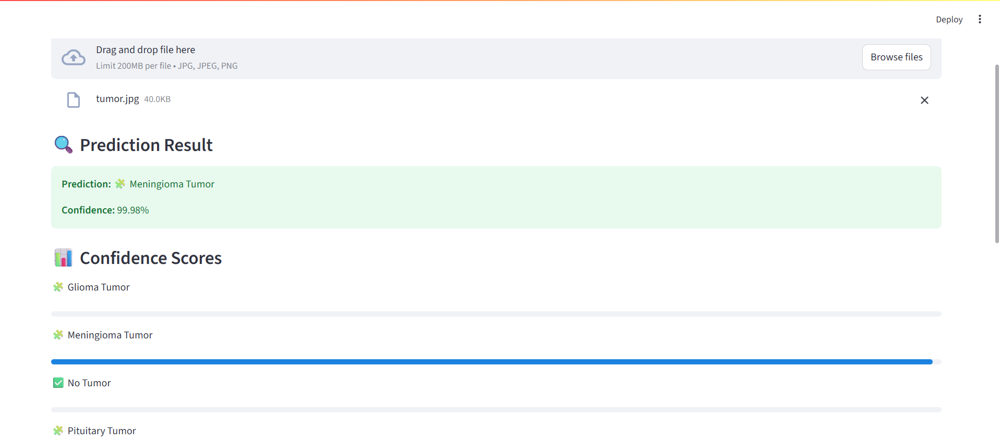
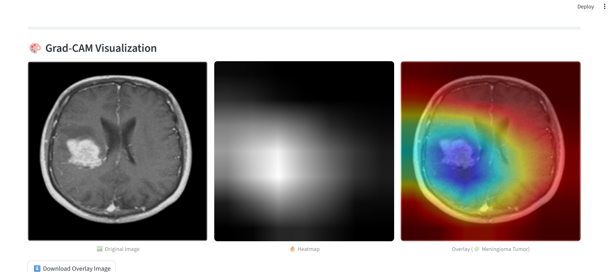

# 🧠 MRI Tumor Analysis with Grad-CAM

A deep learning application for analyzing MRI scans and detecting different types of brain tumors using PyTorch and Streamlit. The application includes Grad-CAM visualization to highlight the regions that influenced the model's decision.

## 🎯 Features

- MRI scan analysis for tumor detection
- Classification of 4 different categories:
  - Glioma Tumor
  - Meningioma Tumor
  - Pituitary Tumor
  - No Tumor
- Real-time Grad-CAM visualization
- Confidence scores for predictions
- User-friendly Streamlit interface
- Downloadable overlay images with heatmap visualization

## 🛠️ Technology Stack

- Python
- PyTorch (Deep Learning)
- Streamlit (Web Interface)
- OpenCV (Image Processing)
- ResNet-18 (Neural Network Architecture)

## 📋 Requirements

- Python 3.10
- PyTorch
- Streamlit
- OpenCV
- Pillow
- torchvision
- NumPy

## 🚀 Installation

1. Clone the repository:
```bash
git clone [your-repository-url]
```

2. Install dependencies:
```bash
uv pip install -r requirements.txt
```

## 💻 Usage

1. Start the Streamlit application:
```bash
streamlit run app.py
```

2. Upload an MRI scan image through the web interface
3. View the results including:
   - Tumor classification
   - Confidence scores
   - Grad-CAM visualization
   - Original, heatmap, and overlay images

## 📊 Model Architecture

The project uses a modified ResNet-18 architecture (MRINet) pre-trained and fine-tuned for MRI tumor classification. The model includes:
- ResNet-18 base architecture
- Custom fully connected layer for 4-class classification
- Grad-CAM implementation for visualization

## 📁 Project Structure

```
MRI_Analysis/
├── app.py                 # Main Streamlit application
├── mri_classifier.pth     # Trained PyTorch model
├── Training/             # Training dataset
│   ├── glioma_tumor/
│   ├── meningioma_tumor/
│   ├── no_tumor/
│   └── pituitary_tumor/
└── Testing/              # Testing dataset
    ├── glioma_tumor/
    ├── meningioma_tumor/
    ├── no_tumor/
    └── pituitary_tumor/
```

## 🎓 How It Works

1. **Image Upload**: User uploads an MRI scan through the Streamlit interface
2. **Preprocessing**: Image is resized, normalized, and converted to tensor
3. **Prediction**: Model predicts the tumor type and confidence scores
4. **Visualization**: Grad-CAM generates heatmaps showing relevant areas
5. **Results**: Display includes original image, heatmap, and overlay

## 📸 Screenshots

Here are some screenshots demonstrating the application in action:







## ⚖️ License

[Add your license information here]

## 👥 Contributors

[Add contributor information here]
